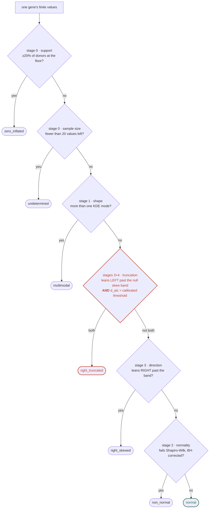

# CLAUDE.md

This file tells Claude Code what this repository is and what to do in it. Assume
no prior context — everything you need is here or in `fourparam/`.

## What this project is

For each of the **54 GTEx v11 human tissues**, we characterise the shape of every
gene's expression-level distribution across the population of donors. Per gene we
fit a **4-parameter Gaussian** to its 40-bin expression histogram and compute a
set of shape / truncation metrics (see "Generated statistics" below). The headline
metric is the **truncation index**: how strongly the right tail of a gene's
distribution is "capped", which is a candidate signal for genes whose
over-expression is deleterious (individuals expressing past a ceiling are censored
from the healthy population, truncating the distribution).

The expression matrices have already been downloaded and transformed (see
`data/`). **Your job is to generate the fourparam tables** (see "What to do").

## Layout

```
CLAUDE.md                     <- this file
fourparam/                    <- all the code (kept separate from the data)
  bhuvanfitter.py             <- the fit library (4-param Gaussian, KDE, truncated MLE + metrics); single source of truth
  normality.py                <- distribution-classification cascade + calibrated thresholds
  compute_qc.py               <- generate ONE qc table from ONE matrix (raw or excluded)
  compute_r2.py               <- add r_squared to ONE table, without refitting -> r2/
  build_r2.py                 <- publish r_squared to the browser as a fixed-width string
  append_r2_column.py         <- append r_squared as a real last column of the excluded tables
  stage_worm_table.py         <- publish the C. elegans table, repairing Excel-mangled gene names
  generate_fourparam.py       <- generate ONE fourparam table from ONE matrix (raw or excluded)
  generate_all.py             <- driver: both tables for every tissue -> 108 tables
  run_cluster.py              <- same 108 tables, spread over several machines
  convert_gct_to_log2.py      <- (reference) raw GTEx GCT -> log2(TPM+1)-1 CSV
  download_data.py            <- (reference) how data/ was produced
  extract_genes.py            <- pull a gene set out of the tables -> one tidy CSV
  build_gene_major.py         <- re-orient outputs/ into gene_major/ shards
  build_hist_major.py         <- mirror hist/hist_max into hist_major/ shards
  build_gui_data.py           <- regenerate the browser GUI's static inputs
  make_diagrams.py            <- 5-histogram summary sheet per table -> diagrams/ + excluded_diagrams/
  make_r2_diagrams.py         <- one R^2 histogram per tissue -> r2_histograms/
  verify_hist_columns.py      <- check hist/hist_max invariants in outputs/
  tests/                      <- pytest suite: `python -m pytest tests/ -q`
data/                         <- the 54 input matrices (nothing else)
  v11_log2_<tissue>.csv.gz    <- one per tissue, already log2(TPM+1)-1 transformed
outputs/                      <- the generated tables go here (starts empty)
  v11_log2_<tissue>_fourparam.csv                              <- raw (not browsable)
  v11_log2_<tissue>_fourparam_excluded_at_or_below_-1.csv      <- excluded <= -1, +r_squared
qc/                           <- distribution class + fit-validity, joined on `gene`
  v11_log2_<tissue>_qc[_excluded_at_or_below_-1].csv
r2/                           <- r_squared alone, joined on `gene` (see "Fit quality")
  v11_log2_<tissue>_r2[_excluded_at_or_below_-1].csv
worm/                         <- C. elegans, one table (see "Worm data")
  worm_fourparam_excluded_at_or_below_-1.csv
gene_major/                   <- the same rows re-oriented for the browser
  shard_NNNN.csv              <- 16 genes x all 54 tissues x both filters
hist_major/                   <- just hist/hist_max, sharded the same way
  shard_NNNN.csv              <- one gene's histograms for ~5 KB
diagrams/                     <- one 5-histogram summary sheet per RAW table
  v11_log2_<tissue>_fourparam.png
excluded_diagrams/            <- the same sheets for the EXCLUDED (<= -1) tables
  v11_log2_<tissue>_fourparam_excluded_at_or_below_-1.png
r2_histograms/                <- one R^2 histogram per tissue, excluded set
  v11_log2_<tissue>_r2_hist.png
  _overview_r2_by_tissue.png  <- all 54 on shared axes, ordered by donor count
genelists/                    <- reusable gene sets, one token per line
results/                      <- extracted gene subsets (output of extract_genes.py)
```

At the **repo root** (one level up) `docs/` holds the GitHub Pages GUI — see
"The browser GUI" below.

Requires Python with `numpy`, `pandas`, `scipy` (and `matplotlib`, imported by
`bhuvanfitter.py`).

## The data (`data/`)

Each `data/v11_log2_<tissue>.csv.gz` is a **genes-as-rows** matrix:

    Name,Description,<sample_1>,<sample_2>, ...
    ENSG00000223972.6,DDX11L1,-1.0,0.585, ...

- `Name` = versioned Ensembl gene id (the gene identifier).
- `Description` = common gene name / symbol.
- Every other column is one donor sample.

Values are already **`log2(TPM + 1) - 1`** transformed (linear TPM → log2). Under
this transform **TPM = 0 maps to exactly `-1`** (the floor, no clamping) and every
value is `>= -1`. Integer TPMs 0,1,2,3,… → −1, 0, 0.585, 1, …

## What to do (produces 108 tables)

Generate **two** fourparam tables **per tissue** — 54 tissues × 2 = **108 tables**
in `outputs/`:

```bash
cd fourparam
python generate_all.py            # both tables for all 54 tissues (skips any already written)
```

`generate_all.py` is resumable — it skips tables that already exist, so if it is
interrupted just run it again. Tune `--jobs N` for parallelism (default 8);
`--max-nfev` caps the curve-fit effort (default 2000).

### Running it across several machines (much faster)

The work is ~74.6k curve fits per table and ~7.5M in total, which is hours on
one box. `run_cluster.py` spreads the 54 tissues over several machines:

```bash
cd fourparam
python3 run_cluster.py                    # all configured nodes
python3 run_cluster.py --dry-run          # show the plan, run nothing
python3 run_cluster.py --nodes local,kup  # a subset
```

It reimplements none of the science — each node runs `generate_fourparam.py`
unchanged, so the tables match a local run. Nodes pull from a shared work queue,
so machines with different core counts and speeds each do as much as they can
and a slow or dead node just does less rather than stalling the run. Per tissue
a node receives the one `.csv.gz`, writes both tables, sends them back, then
deletes its copy. Like `generate_all.py` it is resumable, so re-running it picks
up whatever is missing.

Nodes are listed in the `NODES` table at the top of the script (an
`~/.ssh/config` host alias plus the worker count to use); `local` means this
machine, with no copying. Each remote node needs a `~/fourparam-venv` holding
`numpy`, `pandas`, `scipy` and `matplotlib` — a preflight check imports
`bhuvanfitter` and runs a real fit on every node, and drops any node that fails
instead of letting it die mid-run.

To fetch a tissue matrix that is missing from `data/` (the converted
`log2(TPM+1)−1` CSV is derived from GTEx's raw GCT):

```bash
cd fourparam
python download_data.py --tissues thyroid,whole_blood   # omit --tissues for all 54
```

To fit one tissue by hand:

```bash
cd fourparam
# raw table
python generate_fourparam.py --input ../data/v11_log2_liver.csv.gz \
    --id-col Name --name-col Description --jobs 8
# excluded (<= -1) table
python generate_fourparam.py --input ../data/v11_log2_liver.csv.gz \
    --id-col Name --name-col Description --threshold -1 --jobs 8
```

### Check the histogram columns after regenerating

```bash
cd fourparam
python verify_hist_columns.py                      # every table in outputs/
python verify_hist_columns.py --tissues uterus     # just one
```

Exits non-zero on any problem. It checks the things the browser depends on and
cannot defend itself against: uniform field counts (one stray comma in `hist`
shifts every column index after it), fixed 40-char `hist`, integer `hist_max`,
`hist` empty exactly when `n_obs = 0`, and — the one that has already bitten
once — **no histogram shipped without its `min`/`max` bin edges**.

### The two table types differ by exactly one filter

- **raw** (`v11_log2_<tissue>_fourparam.csv`): keeps **every finite** expression
  value for each gene.
- **excluded ≤ −1** (`..._fourparam_excluded_at_or_below_-1.csv`): additionally
  drops every value **at or below −1** from a gene's array *before* fitting.
  Because `log2(TPM+1)−1` hits `−1` only at TPM = 0, this removes exactly the
  **zero-expression (undetected) samples**, so a gene's `n_obs` shrinks and it may
  fall below the minimum.

Nothing else changes between the two — same fit, same handling. The excluded
tables carry one extra column, `r_squared` (see "Fit quality"); the raw ones do
not, because `r2/` was only ever computed for excluded.

> **The browser serves the excluded tables only.** `manifest.json` no longer
> lists a `raw` kind, and the *Values included* toggle is gone from both the
> results tab and the gene page — the zero-expression spike drags the fit, so
> every analysis here worked off the excluded tables anyway. The raw tables are
> still generated and still in `outputs/`, still reachable through
> `extract_genes.py --table raw`; they are simply not published to the page. A
> shared link carrying `table=raw` now opens on the excluded tables.

### Default filters (applied to BOTH table types)

These are the standard filters and are **not** specific to the excluded table.
Per gene, in order:

1. **Drop non-finite values** (NaN / inf).
2. *(excluded table only — this is the one exclusion-specific step)* drop values
   **≤ −1**.
3. **Minimum observations:** if the surviving count `n_obs < 10` (`MIN_OBS`), the
   gene is still written, as a row with `fit_success = False` and all metrics
   `NaN`. Genes are never silently dropped.
4. **Fit convergence:** if `curve_fit` fails to converge, same
   `fit_success = False` / `NaN` row.

So the **only** thing that makes an "excluded ≤ −1" table different from a "raw"
table is step 2. Everything else — the finite filter, the `MIN_OBS = 10` floor,
the failure rows, the columns — is default behaviour shared by both.

> Note on downstream analysis filters: some analyses additionally keep only
> `fit_success == True`, `0 < truncationindex < 1`, and raise the floor to
> `n_obs >= 30`. Those are **analysis-time** filters you apply when *using* a
> table — they are deliberately **not** baked into the generated tables, which
> keep every gene (with `fit_success` flags) so nothing is thrown away up front.

## Generated statistics (columns of every table)

One row per gene. Columns, in order:

| column | meaning |
|---|---|
| `gene` | Ensembl gene id (`Name`) |
| `genename` | common gene name / symbol (`Description`) |
| `y0` | fitted Gaussian baseline offset |
| `A` | fitted amplitude (peak height above baseline) |
| `x0` | fitted peak centre |
| `w` | fitted width (`w = sigma * sqrt(2)`) |
| `sumsquarevalue` | residual sum of squares of the fit (lower = better). **Unnormalised** — it tracks `n_obs` (ρ = 0.99 across tissues) and cannot compare two genes. Use `r_squared` from `r2/` for that; see "Fit quality" |
| `ti_fourparam_sigma_dist` | `(x_max − x0)/(w/√2)` — how many σ the ceiling sits above the peak; **lower = more truncated** |
| `truncationindex` | **height-ratio truncation index**, `f(x_max)/f(peak)` with the curve's interval-minimum subtracted from both; **bounded [0, 1]**; higher = more truncated (0 = ceiling at curve min, 1 = ceiling at peak) |
| `min`, `max` | min / max of the values used for the fit |
| `mean`, `std` | mean and **sample** std (ddof=1) of those values |
| `skew`, `kurt` | skewness and **Fisher excess** kurtosis (normal → 0) of those values |
| `right` | the truncation ceiling `x_max` used by the metrics (the data max) |
| `maxheight`, `rightheight` | curve height at the peak / at `x_max`, above the curve's interval-minimum baseline (`truncationindex = rightheight/maxheight`) |
| `n_obs` | number of finite values fit (after any exclusion) |
| `fit_success` | `True` if the fit converged with `n_obs >= 10`, else `False` (metrics `NaN`) |
| `hist` | 40-character thumbnail histogram, one character per bin from `A-Za-z0-9+/` (= 0–63), each `round(count * 63 / hist_max)`. **Not analysis data** — quantised and lossy to 1/63 of the peak. Read by the browser's **gene page**, which decodes it into real bars and overlays the fitted curve on the same count axis. Not by the table's Shape cells, which draw the fitted curve alone. Empty when `n_obs = 0`. Written whenever `n_obs >= 1`, **independent of `fit_success`**, so a gene whose fit failed still shows its real distribution. Bin edges are not stored: they are `linspace(min, max, 41)`, and numpy widens a zero-width range to `[min-0.5, max+0.5]` |
| `hist_max` | exact count in the tallest bin; `0` when there is no histogram (never `NaN` — one `NaN` in the column makes pandas write every other row's value as a float) |
| `r_squared` | **excluded tables only, last column.** `1 − SSR/TSS` over the 40 bins, appended verbatim from `r2/` by `append_r2_column.py` — nothing is refit. Blank on a `fit_success = False` row. Deliberately **not** in `manifest.columns`: the browser reads the `r2/` join instead, so that the gene-major route gets it too. Read it beside `n_obs`, never alone — at 40 fixed bins `1 − R² ≈ 1.1 × bins/n`, so R² partly restates donor count |

Fitting details (in `bhuvanfitter.py`, the single source of truth): the histogram
is always **40 bins**; the curve is fit by ordinary least squares (Trust Region
Reflective) minimising the residual sum of squares; the truncation ceiling
`x_max` defaults to the gene's observed max. The `mean/std/skew/kurt` are plain
summary statistics of the (post-exclusion) values and are reported regardless of
whether the fit converged (NaN on a `fit_success=False` row).

## Extracting a gene set (`extract_genes.py`)

Pulls the rows for a gene set out of all 108 tables into one tidy CSV, one row
per `gene × tissue × table`, carrying every statistic column:

```bash
cd fourparam
python extract_genes.py --genes APP SNCA "ALDH*" -o ../results/genes.csv
python extract_genes.py --genes-file ../genelists/adh_aldh_plus.txt -o ../results/out.csv
python extract_genes.py --genes "ADH*" --tissues liver,lung --table raw -o out.csv
```

Tokens may be gene symbols, Ensembl ids, or globs (matched against symbols first,
then ids). **Ensembl versions are always stripped before matching** — GTEx bumps
the `.NN` suffix between releases, so an id list written against an older
annotation (`ENSG00000142192.20`) still resolves against these tables (`.22`).
Matching the full versioned string would silently return nothing, which is the
single easiest way to get a wrong answer here.

Each query token is reported as resolved (with what it hit) or `NOT FOUND`, so a
typo or an absent symbol is loud rather than quietly empty.

## Distribution sheets (`diagrams/`, `excluded_diagrams/`, `make_diagrams.py`)

One PNG per table — 54 tissues × 2 filters = **108 sheets, 540 histograms** —
covering `truncationindex`, `sumsquarevalue`, `mean`, `std`, and
`ti_fourparam_sigma_dist` over the genes in that table, plus a panel stating what
was excluded. File names mirror the table names, so a sheet sorts next to its
source.

**The two filters go to two directories** — raw sheets to `diagrams/`, excluded
(`<= -1`) sheets to `excluded_diagrams/`. They answer different questions and are
almost never read side by side; in one flat folder of 108 the pairs interleave
alphabetically and neither set can be skimmed. Routing is by the source table's
own filename suffix, not by the display label, so rewording a title cannot
silently relocate files. Override with `--diagrams` / `--excluded-diagrams`.

```bash
cd fourparam
python make_diagrams.py                 # all 108, skips existing
python make_diagrams.py --tissues liver --force
```

Only `fit_success == True` rows with a finite value are histogrammed, and the
dropped counts are printed on the sheet rather than silently omitted.

**The axis rules are per-metric on purpose** — these five columns do not share a
shape, so one rule cannot serve them all. Do not "simplify" them to a common
linear axis; each choice is load-bearing:

- `truncationindex` is bounded [0, 1] and violently zero-inflated (~91% of liver
  genes sit at exactly 0). Fixed [0, 1] domain with a **log count axis**; on a
  linear one the panel is a single bar and the tail is invisible.
- `ti_fourparam_sigma_dist` spans ~6 orders of magnitude either side of zero
  (degenerate fits with `w ≈ 1e-4` reach 1e5 while the meaningful range is single
  digits). **Symlog x**, linear within ±1, with symlog-spaced bins. Nothing is
  clipped — no linear window shows the bulk without hiding ~10% of the genes.
- `sumsquarevalue`, `mean`, `std` get an adaptive linear window: the narrower of
  the 6×IQR fences and the p0.5–p99.5 span that hides ≤ 2%, falling back to
  whichever hides less. The hidden count is stamped on the panel.

## Distribution QC (`qc/`, `compute_qc.py`, `normality.py`)

Answers two questions the fourparam tables cannot: **is this gene's distribution
even Gaussian**, and **is this particular fit usable**. One row per gene, joined
to `outputs/` on `gene`.

```bash
cd fourparam
python compute_qc.py --input ../data/v11_log2_kidney_cortex.csv.gz \
    --id-col Name --name-col Description --jobs 8              # raw
python compute_qc.py --input ../data/v11_log2_kidney_cortex.csv.gz \
    --id-col Name --name-col Description --threshold -1 --jobs 8  # excluded
```

Skips existing output unless `--force`. ~16 MB and a few minutes per table.

**This deliberately does not add columns to `outputs/`.** Those tables are
mirrored into 4,665 gene_major shards, pinned by four hardcoded column lists,
and carry a byte-identity guarantee with `extract_genes.py`. A separate table
joined on `gene` costs none of that.

### The cascade (`normality.py`)

One p-value is not an answer, because "not normal" covers zero-inflation,
bimodality, right skew and right-truncation, and only the last is this project's
hypothesis. Each stage only sees what survives the one before:



Falling through means "still a candidate"; branching right ends the test. The
**order is load-bearing** — a bimodal gene is also non-normal and also skewed, so
asking in a different sequence would give it a different, less informative label.

| stage | function | rules out |
|---|---|---|
| 0 | `classify_support` | ≥20% of donors at the −1 floor — a spike plus a smear, not a failed Gaussian |
| 1 | `count_modes` | >1 KDE mode (reuses `gene_peaks`) — wants a mixture, not a truncated Gaussian |
| 2 | `run_tests` | Shapiro–Wilk, D'Agostino–Pearson, Anderson–Darling |
| 3 | skew direction | right-truncation removes the **upper** tail, so it makes skew **negative** |
| 4 | `fit_truncated` + `calibrate_null` | truncated-Gaussian MLE vs plain Gaussian, against a simulated null |
| 5 | `classify` | one `dist_class` label |

**Kolmogorov–Smirnov is deliberately absent** — against parameters estimated from
the same sample its null distribution is wrong, and Lilliefors is still weaker
than Shapiro–Wilk here.

**`FLOOR` is −0.75, but the excluded table cuts at −1.0, and that gap is
deliberate.** Values in `(−1, −0.75]` survive the exclusion filter and still
count toward `frac_at_floor`, so 59.6% of genes stay `zero_inflated` in the
excluded kidney-cortex table. That is correct, not a leak: the band maps to
`0 < TPM ≤ 0.19`, which is trace expression, and a gene made up of it is no more
Gaussian than one made of exact zeros. It matches `has_minus_one_peak` in the
notebook. Genes where *every* donor was at TPM=0 come back `undetermined`
(n_obs = 0 after filtering), which is 14.1% of the excluded table.

### `calibrate_null` is the load-bearing piece — do not replace it with a constant

The truncation point is fixed at the **observed maximum**, which is
data-dependent and therefore biased toward the truncated model. Measured against
2,000 samples drawn from a true Gaussian at n=104:

```
dAIC > 2      fires on 41.4% of genuinely normal data   <-- unusable
dAIC > 5.87   is the calibrated 95th percentile          <-- correct at n=104
skew noise    +/-0.37 at n=104                           <-- |skew| below this is nothing
```

So `d_aic` and `skew` are **always** judged against `calibrate_null(n)`, never a
literal. `d_aic` is a likelihood ratio between two location-scale families and
`skew` is standardised, so both are scale-free — one calibration per sample size
serves every gene in a tissue, and it is `lru_cache`d for exactly that reason.
`tests/test_normality.py` pins both the ~5% flag rate on held-out null data and
the fact that the naive threshold is wrong.

**Power is the real limit.** At n=104 a ceiling at 0.5σ or 1σ is detectable; at
2σ or 3σ it is not, because too little mass is missing to see. Read a null result
in a small tissue as "underpowered", not "no truncation". Kidney cortex has 104
donors and ranks 49th of 54; muscle skeletal has 818.

### QC gates are absolute, not percentile-based

A percentile rule flags a fixed fraction however good the fits are. These are
derived quantities with meaning, so they get real thresholds:

| gate | keep | catches (kidney cortex, raw) |
|---|---|---|
| `sigma_span_ratio = (abs(w)/√2)/(max−min)` | 0.05 – 1.0 | **~25%** collapsed spikes below, **3.3%** APP-mode above |
| `x0_in_range` | `x0` ∈ `[min, max]` | **23.5%** — peak never observed |
| `n_obs` | ≥ 30 | thin excluded-table rows |
| `frac_at_floor` | < 0.20 | **63%** zero-inflated |

Two opposite degeneracies both report `fit_success = True`: `w → 0` collapses the
Gaussian onto one bin (DDX11L1: `w ≈ 1e-6`, `sigma_dist = −17,676`), and `w → ∞`
fits a shallow slice off the top of an enormous one (APP: `w = 22.7`, σ = 16.0
against a 3.95-unit span, `sigma_dist = 0.124` reading as maximal truncation).
Neither is biology.

**`r_squared` replaces `sumsquarevalue` for within-tissue comparison** — it now ships for all 54 excluded tables in `r2/`, and in the browser; see "Fit quality". The
stored SSR is unnormalised — it scales with n and peak height, so p50 = 58 says
nothing about whether one fit is good.

R² is **not** a monotone function of SSE. `R² = 1 − SSR/TSS`, and TSS grows faster
with donor count than SSR does (muscle: `TSS ~ n_obs^1.82` against `SSE ~ n_obs^1.20`),
so across genes the two need not even agree in sign: Spearman(SSE, R²) has median
**+0.37** over the 54 excluded tables and ranges **−0.60 to +0.52**. In muscle it is
**+0.45** — higher SSE goes with *better* R².

Measured values are high, not low — median R² over the 54 excluded tables is **0.816**:

| tissue | donors | median R² |
|---|---|---|
| `kidney_medulla` | 11 | 0.21 |
| `cervix_endocervix` | 23 | 0.23 |
| `adrenal_gland` | 295 | 0.85 |
| `muscle_skeletal` | 818 | 0.91 |

**So R² does not make tissues comparable.** Spearman(donor count, median R²) = **0.975**;
R² = 0.85 is unremarkable in adrenal gland and would be extraordinary in kidney medulla.
It reduces the donor-count dependence rather than removing it — median ρ(`n_obs`, SSE)
= **+0.82** falls only to ρ(`n_obs`, R²) = **+0.60**. Use it to rank genes *within* a
tissue, and compare across tissues by percentile-within-tissue, never by raw R².

### What the first two tissues actually showed — read this before trusting a candidate list

Judge the `right_truncated` rate against the **joint** null of the compound rule
(skew below the band **and** `d_aic` past the threshold). The two criteria are
positively correlated — left skew is exactly what makes the truncated model fit
better — so the joint rate is nowhere near `0.05 x 0.05`. Measured by simulation:
**2.00% at n=104**, **0.67% at n=818**.

| tissue | n | observed (of testable) | joint null | vs chance |
|---|---|---|---|---|
| kidney_cortex | 104 | 0.59% (111/18,819) | 2.00% | **0.29x** |
| muscle_skeletal | 818 | 2.08% (5,000-gene sample) | 0.67% | **3.10x** |

**Power was the limiting factor, and the plan's suspicion was right.** At n=104
there is no excess at all. At n=818 there is a real one, three times chance.
Do not read a null result in a small tissue as absence of truncation — 20 of the
54 tissues have n < 200.

**But the excess is very likely compositional, not lethality.** The candidates
are each tissue's own highly-expressed identity genes, and the two lists do not
overlap at all:

```
kidney_cortex    NPHS2 NPHS1 WT1 SLC22A6 SLC22A8 SLC5A2 SLC6A19 SLC13A3 ANPEP + 11 MT-*
muscle_skeletal  ATP2A1 TNNC1 CASQ2 MYOM3 FHL1 SPEG PPP1R3C RCAN2 TMEM143
```

Both sit at the **92nd-93rd percentile of expression** in their tissue, and MT
genes are **60x enriched** among kidney-cortex candidates (10% vs 0.17%).

Donor-to-donor variation in tissue composition and RNA quality produces exactly
this: a biopsy with less pure cortex has less podocyte and tubule signal, a
degraded sample has less mitochondrial content, and either drags a subset of
donors downward into a long **left** tail. Sample heterogeneity and a biological
expression ceiling are indistinguishable to this statistic.

A dosage-lethality signal should be at least partly **shared** across tissues,
since dosage-sensitive genes tend to be broadly dosage-sensitive. Getting each
tissue's own marker genes back instead is the signature of an artefact.

**Before treating any of these as biology**, regress the candidates against GTEx
sample covariates (RIN, ischemic time, `SMTSISCH`) or a cell-type deconvolution,
and check whether the left tail survives. Those covariates are not in this repo —
they come from the GTEx sample attributes file.

### `dist_class` values

`zero_inflated` · `multimodal` · `right_truncated` · `right_skewed` ·
`non_normal` · `normal` · `undetermined`

`right_truncated` requires **both** skew below the null band and `d_aic` past the
calibrated threshold. Either alone is common noise.

## Worm data (`worm/`, `stage_worm_table.py`)

A second organism, not a 55th tissue. One *C. elegans* fourparam table,
25,849 transcripts, `n_obs = 207` for all but a handful, produced by the same
4-parameter fit over the same 40 bins — so every statistic column means exactly
what it means for a GTEx tissue.

```bash
cd fourparam
python stage_worm_table.py --source <the table as handed over>   # -> worm/
```

**It lives in `worm/`, deliberately not in `outputs/`.** Every script in the
tissue pipeline globs `outputs/` for `*_fourparam*.csv`; dropping a second
organism in there would sweep it into `build_gene_major.py`, the manifest's
`tissues` list and `append_r2_column.py --all` as though it were a tissue.

**Its schema differs by one column.** `gene` is a per-transcript id
(`w233_K04G2.8a.1`), and an extra `wormbasegeneid` (`WBGene00000156`) sits
between `gene` and `genename`. `genename` is *not* unique — 9,755 rows share a
name with another, because isoforms of one gene carry it.

**Excel had eaten eleven gene names.** `mar-1` … `mar-6`, `apr-1`, `jun-1`,
`sep-1`, `oct-1`, `oct-2` are month abbreviations, and the table arrived with
them as `2025-04-01 00:00:00` — 24 rows across those 11 names. `stage_worm_table.py`
reverses it on the way in (month number → abbreviation, day → suffix, which is
unambiguous) and prints every rewrite. Only `genename` is touched, so each one
is checkable against the untouched `wormbasegeneid`: `WBGene00000156` is
`apr-1`, `WBGene00004775` is `sep-1`. **Do not re-export this table through a
spreadsheet** — it will happen again, and `apr-1` is not a gene to lose
silently.

> **No `r_squared` yet.** R² = 1 − SSR/TSS, and while SSR is in the table as
> `sumsquarevalue`, TSS is not recoverable from any published column — it needs
> the 40-bin histogram, hence the underlying expression matrix, which is not in
> this repo (`data/` holds the 54 GTEx matrices only). Once the worm matrix is
> here, `compute_r2.py` followed by `append_r2_column.py` fills the column and
> the browser picks it up with no further change: `wormStatCols()` adds an `R²`
> column exactly when the header has one, and the summary strip gains a median.

## Fit quality (`r2/`, `compute_r2.py`, `build_r2.py`)

`r_squared` for **every** gene in all 54 excluded tables, joined on `gene`.

```bash
cd fourparam
python compute_r2.py --all --jobs 6 --verify     # -> r2/*.csv
python build_r2.py                               # -> docs/r2/*.txt + manifest
python append_r2_column.py --all                 # -> r_squared column in outputs/
```

### Why this exists at all

`sumsquarevalue` is an **unnormalised** residual sum of squares. Across the 54
excluded tables, Spearman(median `sumsquarevalue`, median `n_obs`) = **0.99** —
the column is very nearly a restatement of how many donors the tissue has, and
it cannot rank two genes, let alone two tissues. `r_squared` divides it by the
total sum of squares, which makes it comparable *within* a tissue. It is **not**
comparable across tissues of different size: at 40 fixed bins the ceiling a
perfect Gaussian can reach is itself a function of n (`1 − R² ≈ 1.1 × bins/n`,
so R² ≈ 0.9 needs ~11 observations per bin), and across the 54 excluded tables
Spearman(median `n_obs`, median R²) = 0.97. Rank within a tissue, or against the
per-n floor — never one tissue's raw R² against another's. **Use `r_squared` for any
comparison of fits; `sumsquarevalue` is only meaningful within one gene.**

### Nothing is refit

`R² = 1 − SSR/TSS`, and SSR is already in the table as `sumsquarevalue`. Only
`TSS = Σ(count − mean_count)²` over the 40 bins was never stored, and it is
**not** recoverable from the published columns — `hist` is quantised to 1/63 of
peak and exists in only 2 of the 54 excluded tables. So `compute_r2.py` re-bins
each gene from the source matrix (the cheap half of the pipeline) and reuses the
stored `y0, A, x0, w` untouched. No `curve_fit` call happens.

`--verify` proves the re-binning reproduces the histogram that was fit, by
recomputing SSR from the fresh bins and comparing against the stored
`sumsquarevalue`. Measured on kidney cortex: **max relative error 1.7e-13, zero
`n_obs` disagreements**, and the resulting column is **bit-identical to the
`r_squared` already in `qc/`** on all 49,136 genes with a fit. If a tissue ever
fails that check its histogram is not the one that was fit, and its R² would be
quietly wrong — the run says so loudly.

`compute_r2.py` imports `normality.r_squared` rather than reimplementing the
formula, which is what keeps `r2/` and `qc/` from ever drifting apart.

### It is deliberately not a column of `outputs/`

Same reasoning as the QC tables, and it is the load-bearing decision here:
`outputs/` is mirrored into 4,665 gene_major shards, pinned by four hardcoded
column lists, and carries a byte-identity guarantee with `extract_genes.py`.
Adding a real column means rewriting ~981 MB of excluded tables plus the 2.4 GB
mirror, updating all four column lists, and a very large push. A side-car joined
on `gene` costs ~24 MB and none of that.

### The published encoding

`append_r2_column.py` additionally appends `r_squared` as the **last column of
each excluded table in `outputs/`**, so a CSV downloaded straight from the repo
is complete without a manual join. Same numbers, same file, nothing refit; it is
appended rather than slotted beside `sumsquarevalue` so every column to its left
keeps the position `extract_genes.py`, `indexTable` and the shard builders index
by. It is re-runnable and skips a table that already has the column. The
gene-major mirror in `gene_major/` was **not** rebuilt, which is why the browser
still reads the join and `r_squared` stays out of `manifest.columns`.

`docs/r2/*.txt` is **one `%6.3f` field per gene in `genes.tsv` order** — the same
trade as `build_qc_class.py` and the `hist` column, one field wider because R² is
a number rather than a class. ~437 KB per tissue, and the browser reads gene `gi`
as `text.substr(gi * width, width)`, with no join and nothing to parse.

- **Three decimals** is far finer than the column is ever read to.
- **The sign slot is load-bearing.** R² below zero means the fit is worse than a
  flat line at the mean count — a real verdict, and it must not be clipped to 0.
- Values outside **±9.999** are clamped so the field width holds; `--strict`
  refuses instead. One narrow or wide field shifts every gene after it, which no
  fixed-offset read can detect. `tests/test_r2_sidecar.py` pins the geometry,
  the round-trip, and the manifest contract.
- A gene with no R² is **six spaces**, which reads as blank rather than as a
  number belonging to some other gene.

### What the values look like

Kidney cortex, excluded: median **0.599**, p5 0.19, p95 0.92, and 49,136 of
74,628 genes have one at all (the rest have no converged fit). Across all 54
excluded tables the median is **0.816**, and it is almost entirely a function of
donor count — see the table under "QC gates" and `r2_histograms/` below.

### Seeing the distribution (`r2_histograms/`, `make_r2_diagrams.py`)

```bash
cd fourparam
python make_r2_diagrams.py                       # 54 sheets + one overview
python make_r2_diagrams.py --tissues liver --force
python make_r2_diagrams.py --no-overview
```

One histogram per tissue (excluded set only — that is all `r2/` holds), plus
`_overview_r2_by_tissue.png` putting all 54 on shared axes. Styling matches
`make_diagrams.py` so the sheets read as siblings.

**The overview is ordered by donor count, not alphabetically, because the
gradient is the finding.** Read down it and the shape marches from
`kidney_medulla` (n=11, mass piled near 0, visibly combed — 11 donors in 40 bins
can only produce a handful of distinct R² values) through `kidney_cortex`
(n=104, a broad hump at 0.6) to `muscle_skeletal` (n=818, everything crushed
against 1.0). None of that is one tissue fitting better than another. Sorting
these panels alphabetically hides the single most important thing about the
column.

The per-tissue sheets carry `n`, median, IQR and the fraction below zero — that
last one is the honest fit-failure rate, and it tracks donor count too
(`kidney_medulla` 4.40%, `muscle_skeletal` 0.07%). Values outside `[0, 1]` are
counted on the sheet rather than drawn, so one R² of −9 cannot flatten the axis.

## The browser GUI (`docs/`, GitHub Pages)

`docs/index.html` is a self-contained page published at
<https://bhuvankanna.github.io/bhuvanlab/>. It has two tabs and, behind them, a
per-gene page:

Two columns in the results table are **virtual** — they are not in the fourparam
tables and are joined by gene index rather than by a column: `class`
(`dist_class`, from `qc/`) and `R²` (from `r2/`). Both sit at the end of the
compact set, sort like any other column, and show `—` for a tissue whose table
has not been computed. Neither reaches `statCols()`, so the CSV export stays
byte-identical to `extract_genes.py`.

- **Gene selection** — type-ahead multi-select over genes *and* tissues (both
  boxes work the same way; tissue matching is underscore-insensitive so "whole
  blood" finds `whole_blood`) and an explicit **Load tables** button. There is no
  table-kind toggle: every table the page serves is the excluded ≤ −1 one. The gene box also takes a **pasted or typed list** —
  see "Pasting a gene list" below. Results are one row per gene × tissue, each carrying a
  checkbox and **two views of that gene's fitted curve** — one in real log2
  units, one on a fixed sigma axis (see "The two shape columns" below).
- **Working set** — rows ticked on the first tab, accumulated across any number
  of separate queries, filterable, and exported as one CSV.
- **Worm data** — the *C. elegans* table on its own tab: no tissue or gene
  selection to make, so the whole 8 MB table is fetched on first open, then
  filtered, sorted and exported in the page. It reuses `fittedCurveCell`,
  `shapeCell`, `fmt` and `COMPACT_COLS` unchanged, and shares nothing else —
  WormBase ids are not in `genes.tsv`, so there is no working set (its key is
  `tissue|kind|ensembl-id`) and no gene page (every panel there is "this gene
  across the other tissues"). Its R² is read from the table's own `r_squared`
  column, not the `r2/` join, since there is no gene-major mirror to keep in
  step. **The page turns green while this tab is open** — `data-view="worm"` on
  `<html>` moves `--accent` and `--curve`, which is why the sparklines change
  colour too. The block has to be repeated for all three theme states, and sits
  after the theme blocks so equal-specificity selectors go the worm's way.

### Pasting a gene list

The gene box accepts a whole roster at once, not just one type-ahead pick at a
time. Paste it, or type it and press Enter; separators are commas, semicolons,
pipes, tabs and newlines, so a spreadsheet column pastes as-is. Surrounding
quotes are stripped.

**Matching follows `extract_genes.py` exactly**, which is the point — the same
token must resolve to the same gene in the browser and at the CLI. Symbol first,
then Ensembl id, case-insensitive, and **the version suffix is always stripped**
so a list written against an older annotation (`ENSG00000142192.20`) still
resolves against these tables (`.22`).

**Globs are deliberately not expanded here**, unlike `extract_genes.py`. A pasted
list is meant to be an exact roster, and `ALDH*` quietly becoming 27 chips is
precisely the surprise the warning exists to prevent — it is reported as
unrecognised instead.

**Nothing is silently dropped.** Recognised genes are added even when some tokens
fail, so 200 genes with 3 typos gives you 197 plus a warning naming the 3. The
warning sits under the gene box and reports unrecognised tokens (first 12, then
`+N more`), how many duplicates were folded, and how many were actually added.
Tokens are escaped before display — they are untrusted text pasted by the user.

A single token with no separator is left entirely alone and still goes through
the type-ahead, so the old one-at-a-time flow is unchanged.

### The gene page

Clicking a gene name in **either** table opens one gene, everywhere it was
measured. It is not a third tab: it replaces the tab bar, and Back (the button,
`Escape`, or the browser's own Back — they are the same history entry) returns
to whichever tab you came from with its table intact.

| panel | source | notes |
|---|---|---|
| Distribution in the focus tissue | `hist` / `hist_max` decoded against `min`/`max`, plus `R²` from `r2/` | 40 real bars plus toggleable overlays: the 4-param fit, a moment-matched normal from `mean`/`std`, `y0`, `x0`, `x_max`, `min`, ±1σ/±2σ. The stat strip carries `R²` next to `fit`, so "the fit converged" and "the fit is any good" are never confused |
| `mean` across all 54 tissues | gene-major shard | zero-anchored bars + a ranking sentence |
| `truncationindex` / `ti_fourparam_sigma_dist` across all 54 tissues | gene-major shard | same, with a metric toggle |
| What this gene is | **mygene.info**, live | name, summary, aliases, locus |
| Associated phenotypes | `docs/overexpression_phenotypes.tsv` + **Ensembl**, live | curated over-expression drivers first, then every Ensembl association |

Four things about it are load-bearing:

1. **The whole across-tissue half is one fetch.** A gene-major shard already
   holds 16 genes × 54 tissues × both filters in ~220 KB, so the page costs one
   request, not 54. Do not make it walk `outputs/`.
2. **The histogram is one 40-character string, and it is fetched as one.**
   Clicking a gene names the gene, the tissue and the filter, so exactly which
   histogram is needed is already known. `hist` lives only in the tissue-major
   tables, though, and reaching into one costs ~8 MB to read 43 bytes — so the
   two columns are mirrored into `hist_major/` (see below) and the page fetches
   a **~5 KB shard**, in parallel with the gene-major shard rather than after
   it. There is no large download anywhere in this path and nothing to press.

   A tissue whose table has no `hist` yet says so and offers a one-click jump to
   one that does; a failed fetch leaves a retry. Neither is an error state. If
   a whole tissue table happens to be cached from a Load on the selection tab,
   its own `hist` is used instead — the two carry the identical string, which
   `build_hist_major.py --verify` pins.
3. **The description and the general phenotype list are fetched live from
   mygene.info and rest.ensembl.org** and are the only things on the page not
   from this repository. Both are optional — a blocked, offline or slow request
   (9 s timeout) leaves that panel saying so and changes nothing else. They are
   labelled as external wherever they appear.
4. **Ties are named, not hidden.** `truncationindex` is exactly 0 for most genes
   in most tissues, so "25th of 54" is usually a 30-way draw; the ranking
   sentence says how many tissues share the value rather than implying a
   position. The σ-distance bars clip to ±6σ (degenerate fits reach 10⁵) and
   clipped bars carry a caret — the printed number is never clipped.

### `hist_major/` — the histograms on their own

```bash
cd fourparam
python build_hist_major.py            # 4,665 shards, ~24 MB, seconds
python build_hist_major.py --verify   # re-reads a sample against outputs/
```

`shard_NNNN.csv` is `tissue,table,gene,hist,hist_max`, sharded with **the same
rule and the same shard numbers** as `gene_major/`, so `docs/genes.tsv`'s third
column addresses both and the browser needs no second index. Only tables that
actually carry `hist` contribute rows, so the sidecar is sized by what has been
generated (4 tables → 285,933 rows, ~5 KB per shard) rather than by the gene set.
Genes with `n_obs = 0` have no histogram and are simply absent.

**Why a sidecar and not two more columns on `gene_major/`:** that directory is
2.46 GB and every shard would be rewritten to carry columns that are empty for
104 of the 108 tables — a ~1 GB push to publish ~24 MB of real data. It would
also mean touching `SHARD_HEADER`, one of the four hardcoded column lists that
must agree and the one underwriting byte-identity with `extract_genes.py`. The
sidecar adds nothing to that contract.

`min` / `max` are deliberately **not** repeated here. They are the histogram's
bin edges, but the gene page already has them from the gene-major row, and a
second copy is a second thing to disagree.

Rebuild it whenever you regenerate a table that carries `hist`, then re-run
`build_gui_data.py` so `manifest.hist.gene_major` counts the shards.

`docs/overexpression_phenotypes.tsv` is a curated 58-row / 51-gene table
(`tier`, `driver_confidence`, `mechanism`, `disorder_name`, `phenotype_mim`,
`cytoband`, `scope`, `evidence_quote`) of OMIM and G2P entries where **too much**
gene product is the named disease mechanism — the exact hypothesis the truncation
index tests, which is why a hit there is shown above the general Ensembl list.

### The two shape columns

Each row draws its fitted 4-parameter Gaussian **twice**, 160 x 44px each. The
two answer different questions and neither replaces the other, which is why both
ship. The headers name the axis rather than leaving it to the legend.

| column | axis | answers |
|---|---|---|
| **Fitted curve** | real log2 units, `[min, max]` + 12% right pad | what shape was fit to this gene, on the scale the `x0` / `w` / `min` / `max` columns are printed in |
| **Curve coverage** | fixed −4σ … +4σ, same for every gene | how much of that curve the data actually spans, and where the ceiling sits |

Shared ink: solid + filled is observed, dashed is censored past the ceiling,
rust vertical is the ceiling `x_max`. Coverage adds a dotted curve below `min`
(modelled, never observed) and a muted dashed line at the data floor `min`.

**Fitted curve** — `fittedCurveCell()`, reads `y0`, `A`, `x0`, `w`, `min`,
`max`, `right`.

- **The pad is 12% past `max`, on the right only.** `x_max` *is* the data max,
  so without it the ceiling lands exactly on the frame border and carries no
  information. The asymmetry is the message: the cap is on the right. Do not
  tidy it into symmetric padding.
- **y is anchored at zero; only the top is data-derived.** `outputs/` carries no
  count axis to borrow, so some self-scaling is unavoidable — anchoring at zero
  is what stops a near-flat fit from being stretched to fill the cell.
- **Both scales are per-gene**, so two of these cells side by side are *not*
  comparable. That is the honest cost of real units, and precisely what the
  column next to it exists to fix.

**Curve coverage** — `shapeCell()`, reads `ti_fourparam_sigma_dist`, `w`, `x0`,
`min`.

- **The bell is universal; only the window is per-gene.** `((x − x0)/w)²` is
  exactly `z²/2` for `z = (x − x0)/σ`, `σ = w/√2`. So in z units every gene's
  fitted curve is the same `exp(−z²/2)` once `y0` and `A` divide out — there is
  no per-gene shape to draw. The content is `z_min = (min − x0)/σ` to
  `z_max = (max − x0)/σ`, and `z_max` **is** `ti_fourparam_sigma_dist`.
- **Marking `z_min` is what makes a degenerate fit visible, and is the whole
  reason this is not just a canonical bell with a cut.** APP in kidney cortex
  fits `w = 22.7` (σ = 16.0) to a 3.95-unit data span, so its entire observed
  range is a **0.25σ sliver** at the apex. `ti_fourparam_sigma_dist` reads
  0.124 — apparently maximal truncation — and `truncationindex` reads 0, and
  neither means anything. Here that row is a thin spike, not a plausible bell.
- **The axis is fixed and never data-derived**, so cells are comparable by
  construction and nothing is rescaled to its own range. Both edges clamp to the
  frame: a gene at 40σ and one at 4σ both read as "no visible truncation", which
  is exactly true at this scale.
- **A window is only drawn when it is one.** An inverted or non-finite `z_min`
  (`w <= 0`, or a table lacking `min`/`x0`) degrades to the bare cut rather than
  inventing an extent.

Neither cell keys off `fit_success` — a converged-but-degenerate fit is exactly
what these pictures are for. Each falls back to `—` only when its own inputs are
missing or non-finite.

> Two earlier designs and why they went:
>
> - A **synthetic sparkline** over the peak's own ±3.4σ, which never showed the
>   data. For APP that window is [−52, 66], rendering the ceiling at 99% of full
>   height while `truncationindex` is 0 — table and picture normalising over
>   windows ~30× apart. See `specs/2026-08-05-histogram-thumbnail-design.md`.
> - The **real 40-bin histogram** from `hist` / `hist_max` with the curve
>   overlaid on the count axis. Correct in principle, but `outputs/` does not
>   carry those two columns, so in production the cell rendered a dash for every
>   row. `hist` and `hist_max` are now in the skip set in `visibleStatCols()` —
>   nothing draws them and an encoded 40-char blob is not a readable table
>   column. They remain in the CSV export, which mirrors the source table rather
>   than this view.

Three things about it are load-bearing and easy to undo by accident:

1. **Loading is explicit, and picks an orientation.** The same numbers exist
   twice — see "Two orientations" below. The page prices the query before
   running it, fetches sequentially, and can be cancelled mid-run (keeping the
   rows already gathered). Do not make it auto-fetch on selection change: the
   tissue-major route is still chosen for many-genes-in-one-tissue queries, and
   there it is the half-gigabyte accident this design exists to prevent.
2. **The working set stores values, not references.** Each entry keeps all 18
   statistic columns, so it survives a reload without re-fetching. It is keyed
   `tissue|kind|unversioned-id`, which is why the same gene can appear for many
   tissues at once. `kind` is now always `excluded`, but it stays in the key so
   entries saved before the raw tables were withdrawn still load. It is persisted to
   `localStorage` under `tb-working-set-v1`; if the quota is exceeded the page
   falls back to memory-only and says so rather than failing silently.
3. **Its CSV matches `extract_genes.py`'s through the last table column** —
   header `tissue, table, gene, genename` then the table's own columns in
   `manifest.json` order, with values passed through as text, and then one
   appended column `r_squared`. R² is joined from `r2/` by gene index rather
   than stored in the tables, so it is appended last rather than placed beside
   `sumsquarevalue`: everything left of it stays byte-identical, and it is blank
   for a gene with no R². Both exports always carry the full statistic set
   regardless of the compact/all column toggle, and the selection export covers
   every loaded row rather than the rendered subset (rendering is capped at 800
   rows). Keep these in sync if columns change.

   > The working set snapshots R² at tick time (`wsAdd`), since the r2 text is
   > cached per tissue and not carried on the row. Entries persisted before that
   > field existed export a blank `r_squared`.

   > This is only true because **nothing re-serialises a float**. `extract_genes.py`
   > reads with `dtype=str, keep_default_na=False`; `build_gene_major.py` builds
   > rows by string concatenation. Parsing to float64 and writing back is *not*
   > lossless: pandas' CSV writer emits ~16 significant digits rather than the
   > shortest round-tripping repr, which silently turned `0.012596832467784065`
   > into `0.012596832467784`. If you make either tool go through floats, this
   > guarantee quietly dies.

**It stores no copy of the tables.** It fetches the real CSV from
`raw.githubusercontent.com` at runtime, so it cannot drift out of sync with
`outputs/`. `raw.githubusercontent.com` serves `Access-Control-Allow-Origin: *`,
so the cross-origin fetch works.

### Two orientations: `outputs/` and `gene_major/`

The same 8,059,824 rows are published twice, because the two shapes answer
opposite questions and a browser query is nearly always the second kind:

| | file | one fetch gets you | cost |
|---|---|---|---|
| tissue-major | `outputs/v11_log2_<tissue>_fourparam*.csv` | every gene, **one** tissue | ~8 MB |
| gene-major | `gene_major/shard_NNNN.csv` | 16 genes, **every** tissue and both filters | ~220 KB |

`shard_NNNN.csv` carries the `tissue,table,` prefix columns that `outputs/` rows
lack — that is exactly the `extract_genes.py` header, so a shard and a CLI
extract concatenate without reconciling anything. The GUI strips those two
fields on read so both routes produce identical row objects downstream.

**Genes are sharded in symbol order, not id order.** That is deliberate: a family
lands in adjacent shards, so all 27 `ALDH*` cost 2 fetches rather than 27. The
whole `adh_aldh_plus` list (38 genes × 54 tissues × 2 = 2,052 rows) is 8 shards,
~1.8 MB, against 432 MB tissue-major.

`docs/genes.tsv` is `id \t symbol \t shard`; the third column is that map. The
GUI picks whichever route fetches fewer bytes, counting only what is not already
cached, and labels the choice in the status line. Rebuild after regenerating any
table:

```bash
cd fourparam
python build_gene_major.py            # ~80 s, 4,665 shards, 2.46 GB
python build_gene_major.py --verify   # byte-compares shards against outputs/
```

Line endings matter here. `build_gene_major.py` copies row text verbatim, so it
normalises CRLF on read; the writers now pin `lineterminator="\n"`. The eight
tables for thyroid/uterus/vagina/whole_blood were written with CRLF by an earlier
run and have been normalised in place.

Pages publishes **only `docs/`** (branch `main`, folder `/docs`). That matters:
the Pages site size limit is 1 GB and `outputs/` alone is 2.05 GB, so publishing
the whole repo would fail.

Regenerate its two static inputs after adding tissues or changing columns:

```bash
cd fourparam
python build_gui_data.py     # writes ../../docs/manifest.json and ../../docs/genes.tsv
```

`genes.tsv` is built from a single table because the gene set is byte-identical
across all 108; `build_gui_data.py` verifies that and aborts if it ever stops
being true.

It also writes two blocks the gene page depends on: `manifest.hist`, which lists
per filter the tissues whose table carries `hist`/`hist_max` (read from the
header of each of the 108 tables, one line apiece), and `manifest.phenotypes`,
which points at `docs/overexpression_phenotypes.tsv` if it is there.

**It rewrites `manifest.json` wholesale but now carries the `qc` block over**
from whatever is already on disk, because that block is owned by
`build_qc_class.py`. Before, rebuilding the manifest silently deleted the
published QC index, and the only repair — re-running `build_qc_class.py` — is
unsafe while a `compute_qc.py` run is live, since `qc/` then holds half-written
tables.

**`--reference <tissue>` picks the table that supplies `manifest.columns`.**
It defaults to the alphabetically first raw table, which is wrong mid-migration:
if you have added a column and regenerated only some tissues, the default table
may not carry it yet and you publish a manifest that silently omits it. The
manifest drives the browser's CSV export, so an omitted column is an export that
quietly loses data.

### Four places hardcode the column list — they must agree

| where | what it is |
|---|---|
| `generate_fourparam.COLUMNS` | what gets written to `outputs/` |
| `build_gene_major.SHARD_HEADER` | what the gene-major mirror expects **and** emits |
| `extract_genes.STAT_COLUMNS` | what the CLI extract emits |
| `docs/manifest.json` `"columns"` | what the browser's CSV export follows |

Drift is silent and expensive: `build_gene_major.py` rejects every table with
"unexpected header" (it fails safe, but the whole run dies), or the browser
export loses columns, or the byte-identity guarantee with `extract_genes.py`
quietly stops holding. `tests/test_column_lists_agree.py` pins all four —
run `python -m pytest tests/ -q` after changing any column.

## Keep this file current

If you change the code, columns, filters, or layout, update this file in the same
change so it always describes the repo accurately.

## Push changes to GitHub as we work

This folder is the `fourparamsacrosstissues/` subdirectory of the GitHub repo
**`BhuvanKanna/bhuvanlab`**. The git root is the **parent** directory
(`bhuvanlab-main/bhuvanlab-main/`), not this folder — run git from there, or with
`git -C ..`.

**After completing any change to files here, commit and push it** without waiting
to be asked:

```bash
cd ..                      # the git root
git add -A                 # stages only altered/new files
git commit -m "<what changed and why>"
git push origin main
```

Write a real commit message describing the change. Batch one logical change per
commit rather than committing every intermediate edit. If a task is still
in progress and the tree is in a broken state, finish it first, then push.

### Things that will bite you if you don't know them

- **The `hist` column must never contain a comma or a quote.** The browser parses
  these CSVs with a plain `split(",")` and has no quoted-field handling, so a
  single comma there silently shifts every column index after it. That is exactly
  why the histogram is one character per bin rather than comma-separated counts.
- **`hist` is quantised and lossy.** It is a rendering aid for the browser
  thumbnail, never a source of truth for counts. `n_obs` and `hist_max` are exact;
  use those.
- **Always write `df["hist"]`, never `df.hist`.** `DataFrame.hist` is pandas' own
  histogram-plotting method, so attribute access silently returns a bound method
  instead of the column and fails somewhere later with a confusing error. The
  generator is unaffected (it builds rows as dicts keyed by `COLUMNS`), but any
  analysis code reading these tables will hit this.
- **`data/*.csv.gz` are Git LFS pointers, not real files.** The repo is
  configured `--skip-smudge` with `lfs.fetchexclude=*`, so those 134-byte
  pointers are correct and must stay that way. ~5.7 GB of LFS payload is
  deliberately not downloaded. Never "fix" them. To get one on purpose:
  `git lfs pull --include="fourparamsacrosstissues/data/v11_log2_liver.csv.gz"`.
  `download_data.py` recognises pointers and leaves them alone; without that
  guard its gzip-integrity resume check would call every pointer corrupt and
  re-download the lot.
- **This is a blobless partial clone** (`--filter=blob:none`), so `.git` is a few
  hundred KB rather than 813 MB. Old file contents are fetched on demand; that is
  intended. `git fetch --refetch origin main` backfills if ever needed.
- **`outputs/` is plain git, not LFS, on purpose.** These CSVs compress 2.46× in
  git (2.05 GB → ~852 MB); LFS stores blobs uncompressed and would cost more.
- **A full 108-table regeneration is a ~852 MB push.** That is slow on a home
  connection and permanently adds that much to repo history. Before pushing a
  regeneration of many tissues, say so and confirm — don't push it silently. A
  single-tissue regeneration (~8 MB compressed) is fine to push normally.
- **Never commit while a generation run is still writing** — a partially written
  CSV looks like a valid file. Wait for the run to finish.
